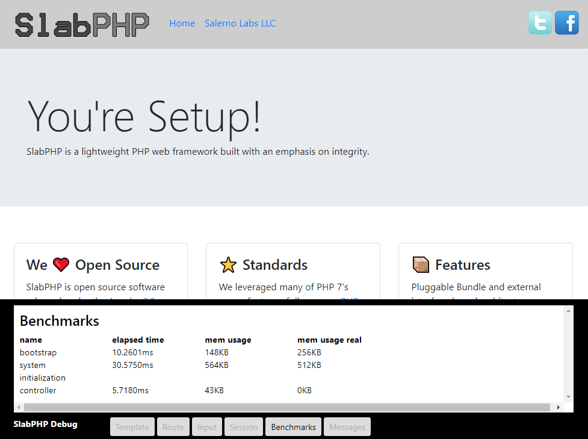

# SlabPHP Debug Bar

When you composer install with dev dependencies, SlabPHP will include a debug utility. The debug utility can be used to display some debug information on the site with a bottom bar that looks like below.

## Template Code

If you override the default shell.php (as you definitely should), you can easily add the debug bar to your site's code by adding the line:

    <?php $this->load('modules/debug.php', $this); ?>
    
Usually before the &lt;/body&gt; tag. The debug utility must be included for it to show up.

## Adding Benchmarks and Messages

See the [debug library](https://github.com/SlabPHP/debug) documentation for more information.

